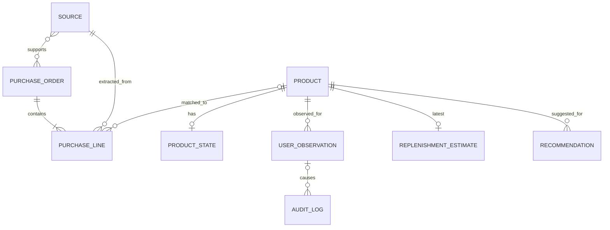

# Personal Commerce 基本設計

状態: Draft v0.2（MVPデータモデル確定）  
最終更新: 2026-10-05  
要件正本: `docs/personal-commerce/requirements.md`

## 1. 設計方針

MVPは「購買履歴を自動で蓄積し、購入周期を推定し、必要時に現在価格・代替商品をAIが調べて提案する」ことに集中する。

将来の自動購入を見越した過剰設計はしない。

設計原則:

- 既存Portal・Firebase資産を優先して活用する
- Firestoreをoperational dataの正本候補とする
- AIへDBの無制限な直接権限を与えない
- AIの書込みはApplication境界を経由する
- 事実、算出値、推定、推薦を分離する
- Gmailの注文メールを主要な購買データソースとする
- 厳密な在庫イベント管理はMVPで行わない
- BigQuery、MCP、Commerce protocolは必要性が出るまで導入しない
- 通常月額1,000円程度以内を目標とする

## 2. MVP論理アーキテクチャ

```text
Amazon / ヨドバシ
        │
        ▼
      Gmail
        │ 注文メール
        ▼
┌────────────────────┐
│ Application / API  │
│                    │
│ - Gmail取込        │
│ - AI構造化         │
│ - 重複・形式検証   │
│ - 購入履歴登録     │
│ - 購入周期計算     │
│ - 補充候補判定     │
│ - ユーザー補正     │
│ - Recommendation   │
└─────────┬──────────┘
          │ 許可された操作のみ
          ▼
     ┌───────────┐
     │ Firestore │
     └─────┬─────┘
           │
     ┌─────┴─────────────┐
     │                   │
     ▼                   ▼
AI会話 / Tool       週次判定
     │                   │
     │              AIで価格・代替調査
     │                   │
     └─────────┬─────────┘
               ▼
            Gmail
               │
               ▼
          ユーザーが購入
```

## 3. コンポーネント判断

| 要素 | MVP判断 | 理由 |
|---|---|---|
| Firebase Auth | 採用 | 既存Portalで利用済み。ユーザー識別に十分 |
| Firestore | 採用有力 | 個人規模のoperational dataに適する |
| GitHub Pages | 継続 | 既存Portalの公開方式を維持 |
| Cloud Run | 採用有力 | Gmail取込、AI処理、定期実行、DB書込境界をサーバー側に置く必要がある |
| Cloud Storage | 条件付き | PDF/CSV等のraw原本を保持する場合に利用。Gmailだけなら必須ではない |
| BigQuery | MVP不採用 | 購入周期計算は個人規模ではApplication処理で十分。DWH同期は過剰 |
| Money Forward | MVP外 | 補充判断の主目的には不要。支出分析時に再検討 |
| MCP | MVP不採用 | Tool境界は必要だがtransportをMCPに固定する要件がない |
| ADK等Agent framework | 未採用 | 単一AI + Toolで不足する場合に再検討 |
| UCP / ACP / A2A / AP2 | 将来 | 購入実行をMVPで行わないため不要 |

## 4. MVPデータモデル（Issue #22確定）

確定日: 2026-10-05。要件 Baseline v1.0 §11–12を具体化する。以下は設計上の決定であり、実メールからの抽出精度・取得可能項目の検証完了を意味しない（#13で検証）。

### 4.1 保存先・共通規約

全て `users/{uid}` 配下。uidは検証済みFirebase tokenまたは定期処理の許可済み設定から取得し、bodyから採用しない。Productもユーザー専用とし、共通商品カタログを作らない。

| collection/document（users/{uid}/以下） | 内容・ID |
|---|---|
| sources/{sourceId} | 元メールと取込結果。sourceId = SHA-256(JSON配列["gmail", accountKey, messageId]) |
| purchaseOrders/{orderId} | 注文。注文番号あり: SHA-256(["order", merchant, merchantAccountKey, externalOrderId])。番号なしはsourceId＋sourceOrderRefのhashで暫定ID |
| purchaseLines/{lineId} | 明細をフラット保存。orderIdを持つ。外部明細IDあり: hash(["line", orderId, externalLineId])、なし: 初回登録時UUID |
| products/{productId} | 商品。UUID。商品名をIDにしない |
| productStates/{productId} | 商品ごとに1件の現在状態projection |
| userObservations/{observationId} | 追記専用ユーザー明示・訂正・解除、IDはclientMutationIdのhash |
| auditLogs/{eventId} | 重要更新の追記専用監査。サーバー生成UUID |
| replenishmentEstimates/{productId} | 最新の算出値・推定のみ、過去版は必要な監査差分で追跡 |
| recommendations/{recommendationId} | その時点の推薦snapshot。SHA-256(["recommendation", clientMutationId]) |
| identityKeys/{keyHash} | 注文・商品識別子・ユーザー固定照合の一意性予約。実装用、業務エンティティを増やさない |

参照は同じuid配下のdocument ID文字列。自動外部キー制約はないためApplicationが存在・所属を検証する。document IDをフィールドに重複保存しない。APIではidを付与する。sources/aliases/inputLineIds等の配列はMVP個人規模に限定し、肥大化した入力は分割を要求して黙って切り捨てない。

- `R`: 必須・非null、`N`: キー必須だが不明ならnull、`O`: 任意で未取得時は省略。[]は既知の空、nullは不明。
- 保存日時はFirestore Timestamp（UTC）。購入日は時刻不明が多いため `orderedOn`: YYYY-MM-DD、`dateTimezone`: IANA zone（MVPはAsia/Tokyo）。本文注文日を優先する。例外としてAmazonの物品「注文済み」メールは、本文注文日がない場合にGmail internalDateのAsia/Tokyo日付を購入日として採用する（ユーザー指定の業務ルール、2026-10-05）。
- 可変document共通R: `schemaVersion:1, revision:int>=1, createdAt:Timestamp, updatedAt:Timestamp`。追記専用document共通R: `schemaVersion:1, createdAt:Timestamp`。
- 金額は最小通貨単位の非負整数＋ISO通貨コード。JPYは円。数量は正のnumberまたはnull。数量不明を1に補完しない。
- 長文・原メール本文・住所・カード情報・OAuth tokenは保存しない。Gmail IDと抽出済み項目で再参照できる。secretは別管理。全enumは許可値のみ。

### 4.2 ER図



SOURCE–ORDERは複数メール/複数注文に対応。source.orderIdsでリンクを保持する。CorrectionはUSER_OBSERVATIONのkind=correctionで、注文/明細訂正ではproductIdを持たずtargetで参照できる。AUDIT_LOGのtargetは任意の対象documentを指す多相参照。ERは論理関係で、物理Firestoreサブcollectionを示さない。

### 4.3 項目定義

可変共通項目は上記を全件へ適用（sourcesを含む）。userObservations/auditLogs/recommendationsは追記専用共通項目を適用。

| モデル | R 必須 | N 不明ならnull | O 任意 |
|---|---|---|---|
| Source / Import Metadata | provider:"gmail", accountKey:string（内部UUID）, messageId:string, receivedAt:Timestamp, messageKind:order/dispatch/cancel/return/unknown, status:pending/imported/duplicate/needs_review/failed, orderIds:string[], attemptCount:int, extractionVersion:string | lastAttemptAt:Timestamp, importedAt:Timestamp | errorCode:string, parserVersion:string, aiModel:string, contentHash:string |
| PurchaseOrder | merchant:amazon/yodobashi, merchantAccountKey:string（内部UUID）, orderedOn:date, dateTimezone:string, sourceId:string, identityStatus:confirmed/provisional, status:ordered/cancelled/returned/unknown, fieldOrigins:map | externalOrderId:string | totalMinor:int, currency:string（totalMinorと対）, userOverrides:map |
| PurchaseLine | orderId:string, sourceId:string, sourceLineRef:string, rawProductName:string, status:ordered/cancelled/returned/unknown, matchMethod:identifier/normalized/ai/user/unmatched, fieldOrigins:map | productId:string, quantity:number, amountMinor:int, currency:string | externalLineId:string, identifiers:map, matchConfidence:number[0,1], userOverrides:map |
| Product | canonicalName:string, aliases:string[], category:string（不明はunknown）, replenishmentStatus:unknown/candidate/active/excluded, decisionOrigin:unknown/ai/rule/user, fieldOrigins:map | brand:string, sizeValue:number, sizeUnit:string, packageType:string, packCount:int | identifiers:map, userOverrides:map |
| ProductState | state:unknown/likely_available/running_low/spare_available/out_of_stock, origin:unknown/user/inference, usage:unknown/current/not_current, usageOrigin:unknown/user/inference | observedAt:Timestamp, observationId:string, usageObservationId:string, suppressUntil:Timestamp | inference:map（state, basedOn, calculatedAt, methodVersion必須） |
| UserObservation / Correction | kind:state/usage/replenishment_status/correction/release, target:{collection,id}, value:型はkind依存, observedAt:Timestamp, recordedAt:Timestamp, source:"user", clientMutationId:string | — | productId:string, note:string, supersedesObservationId:string, correction:{field,before,after}, releaseObservationId:string |
| ReplenishmentEstimate | calculation:{basis:product/category/none, methodVersion:string, purchaseCount:int, intervalCount:int, inputLineIds:string[], inputFingerprint:string, calculatedAt:Timestamp}, prediction:{confidence:insufficient/low/medium, reasonCodes:string[]}, candidate:{eligible:boolean, reasonCodes:string[], evaluatedAt:Timestamp} | calculation.averageIntervalDays:number, calculation.medianIntervalDays:number, calculation.lastPurchasedOn:date, prediction.estimatedNextPurchaseOn:date, prediction.notifyFrom:date | category:string（basis=category時必須） |
| Recommendation | productId:string, generatedAt:Timestamp, contextFingerprint:string, clientMutationId:string, rationale:string, recommendedProduct:{name:string}, alternatives:array | currentPrice:{amountMinor:int,currency:string,sourceUrl:string,observedAt:Timestamp} | estimateRevision:int, recommendedProduct.url:string, aiModel:string |
| AuditLog | actor:user/importer/application/ai, action:create/import/merge/correct/observe/release/recalculate, target:{collection,id}, changes:array<{field,before,after}>, recordedAt:Timestamp, requestId:string | — | sourceId:string, observationId:string, reason:string, methodVersion:string |
| IdentityKey | kind:order/product_identifier/user_match/amazon_csv_attempt, target:{collection,id}, createdAt:Timestamp, schemaVersion:1 | — | constraints:map, inputHash:string / result:map（amazon_csv_attemptのみ） |

補足:
- PurchaseOrderの任意項目に `orderDateBasis:body/gmail_received_date` を追加。新規取込では必ず設定する。Amazon受信日採用時のfieldOrigins.orderedOnは `{kind:"rule",sourceId,methodVersion:"amazon-received-date-v1"}`。受信日を利用してもuser overrideを上書きしない。
- fieldOriginsは取得・分類したフィールドごとに `{kind:source/user/ai/rule, sourceId?, observationId?, methodVersion?}`。source由来はsourceId必須、user由来はobservationId必須。AI抽出の購入日・名称はsource根拠の事実であり、AIの在庫推定とは異なる。
- userOverridesは `{field:{value,observationId}}`。取込事実の現在値とは分離し、読出し時にoverlayする。nullへの訂正も有効な指定。注文・明細・商品へのAI/取込更新はoverrideを削除しない。
- quantity/amountMinor/currencyはnull許容。amountMinor非nullならcurrency必須。amountMinorは明細合計でunit priceとは異なる。注文合計と明細合計の一致は送料・割引で保証しない。
- identifiersは `{jan?,model?,merchantSku?}`。JANはstring、merchantSkuはmerchant＋accountのscopeを付ける。sizeValueとsizeUnitは両方nullまたは両方あり。
- kind=stateのvalueはstate enum、usageはcurrent/not_current/unknown、replenishment_statusは補充対象enum。correctionは許可されたfieldの型検証済み値を持ち、correction.before/afterと整合させる。releaseは解除対象observation IDを指定。
- 推薦代替候補は `{name,url?,price:上記価格型|null,rationale}`。価格未取得時はnull。価格URLと観測日時がない数値は現在価格として保存しない。
- Source.messageIdはGmail APIのmessage IDでありRFC Message-IDとは異なる。1メール内の注文区切りsourceOrderRef/sourceLineRefは抽出前に根拠位置から安定化する。
- sourcesのextractionVersionは使用する抽出契約の版で、まだ試行前は"unprocessed"。failed時も文面・個人情報をerrorCodeへ流さない。

### 4.4 重複防止・商品同一性

CSVバックフィル保存の追加schema: Source.providerは`gmail | amazon_csv`、CSV SourceにはaccountKey/fileHashes/extractionVersion/orderIds/attemptCount/lastAttemptAt/importedAtを保存し、Gmail固有messageId/receivedAt/messageKindは適用しない。PurchaseOrder.orderDateBasisに`csv_order_date`を追加。明細のcsvDisposition/csvReasonCodes/csvOrderDateEvidenceはCSV取込の確認情報。`identityKeys`に`amazon_csv_attempt`（batch+orderの試行inputHash/result）を保存する。詳細と上限・Gmail統合規則は[server/README.md](../../server/README.md#amazon初期履歴の保存)を参照。周期計算は後続。

保存CSV Sourceは`scope:"order"`、`inputSourceId`（Python提案のhistory単位ID）、`importBatchKey`、`sourceOrderKey`を必須追加。保存sourceIdはhash(["amazon_csv_order_source",accountKey,importBatchKey,sourceOrderKey])。全fileHashesは当該Source内で不変。status/importedAtは1注文の処理状態を表し、ファイル全体の完了とは解釈しない。amazon_csv_attemptのtargetは当該sources document。IdentityKeyの共通kind/target/createdAt/schemaVersionは例外なく付与する。

1. **メール**: accountKey＋Gmail messageIdで一意。imported/duplicate済み同一メールは通常再取込をno-opとする。失敗再試行は同じsource documentを使用しattemptCountを増やす。抽出版変更で再処理する場合は明示的reprocessとして監査する。
2. **注文**: merchant＋merchantAccountKey＋外部注文番号をidentityKeysに予約。別メールでも同一orderへ集約。注文番号はtrim等のmerchant別に定めた安全な正規化のみ（ハイフンを無条件に削除しない）。番号欠損はprovisionalとして保存できるが周期集計から除外しneeds_review。日付・金額・名称だけで別注文を自動統合しない。後で番号が判明したらcanonical orderへ統合し参照を付替え、暫定注文を計算対象外にし監査する。
3. **明細**: 同じsource＋sourceLineRefの再処理は同じlineを更新。外部line IDがない場合、同注文内のidentifier＋容量＋包装が一致し一意な既存明細だけを照合。曖昧な重複行はneeds_review、追加計上しない。別メールのdispatchは既存注文を裏付けるだけで新規購入明細を作らない。メール掲載のない明細を削除しない。
4. **商品**: JAN/merchant SKU等の強い識別子→完全一致の正規化名称＋brand＋容量＋包装＋packCount→AI照合の順。未知属性を一致扱いしない。名称aliasだけで容量違いを統合しない。名称はNFKC・空白整理で候補検索、原文はrawProductNameで保存。識別子競合・曖昧照合はproductId=null、unmatchedで保存できる。根拠が十分なAI照合は自動確定可能だがmethod/confidenceと監査を残す。
5. **ユーザー固定**: 誤統合訂正時は対象lineのproductId overrideと、同scopeのidentifierまたは完全な商品属性signatureに対するuser_matchを記録。名称だけの広い固定を作らない。AI照合より優先。商品split/mergeは明細参照と予約キーを付替え、旧新両商品の周期をdirty扱いにする。曖昧な一括訂正は行わない。
6. **同時書込み**: identityKeyの不在確認・予約、対象document、source状態、auditを同じFirestore transactionで確定する。既存予約は同targetなら冪等、別targetならCONFLICT。check-then-writeを別操作にしない。AI呼出しはtransaction外。大き過ぎる入力はneeds_reviewとし、黙って部分登録しない。
7. **ユーザー操作**: clientMutationIdで観測document IDを固定し、同内容再送は同結果、別内容で再利用はCONFLICT。推薦もclientMutationId由来のIDで同内容再送をno-opとし、異なる内容の再利用はCONFLICT。訂正はexpectedRevisionを必須とし競合時に再読込を要求する。監査作成とprojection更新は原子的に行う。

すべての決定的ID/identityKey hashは上記の入力JSON配列の先頭に"v1"を追加し、UTF-8をSHA-256、hex小文字64桁とする。hashは匿名化を保証しないので実データ由来hashも公開fixtureへ入れない。

### 4.5 明示情報、訂正、監査

- **事実**: PurchaseOrder/Line＋Source。訂正前後をAuditLogへ保存し、ユーザー訂正はoverrideとして維持。
- **算出値**: Estimate.calculation。平均・中央値と母数・入力根拠。
- **推定**: Estimate.prediction、ProductState.inference。事実のquantity等を推定で埋めない。
- **推薦**: Recommendationは独立snapshot。価格観測は推薦時点の値。Product/PurchaseLineを書換えない。

現在状態は最新の有効ユーザー観測→推定→unknown。観測の順序はobservedAt、同時刻はrecordedAt、最後にID。過去状態の追記は新しい状態を上書きしない。state/usage/replenishment_statusは別々に解決し、out_of_stockでもnot_currentへ自動変換しない。

明示したcurrentは同カテゴリで1商品を基本とし、切替時は前商品のnot_current観測も同じ操作で残す。カテゴリ不明や複数利用の曖昧さは勝手に決めずunknown/contextで返す。購入に基づくcurrentは推定として返す。

明示情報に無断の期限切れを設けない。`まだある/予備あり` はMVPの具体ルールとして観測から7日間（suppressUntil）周期ベースの通知を抑制する。状態自体は解除しない。期間後の通知は「過去に残ありの申告、周期上は確認時期」と説明し、在庫切れと断定しない。not_current/excludedは解除まで自動通知対象外。out_of_stockはactive/candidateかつ現在利用対象なら周期不足でも確認候補になる。unknownの補充対象はユーザー指定なしでは通知しない。

監査は更新したフィールドのbefore/after（初回はbefore=null）、actor、根拠source/observation、時刻、requestIdを保存。取込原文はログに複製しない。AI・取込の重要更新にも必須。推定再計算のno-opは監査不要。復元はログを書換えず新しいCorrectionで行う。ProductStateとEstimateはprojectionなので履歴から再構築できる。

### 4.6 周期計算・再計算

- 集計対象はconfirmed注文＋ordered明細＋product照合済みのみ。cancelled/returned/unknown、暫定注文、曖昧重複は除外。部分返品で残数量を確定できない明細はneeds_reviewとして周期対象外。発送日ではなく購入日を使う。
- 同商品・同ローカル購入日の複数明細/複数注文は1購入機会へまとめる（0日間隔を作らない）。数量で周期を割らない。packCount/包装/容量違いは別Product。
- purchaseCount = 異なる購入日の数、intervalCount = max(purchaseCount−1,0)。2日以上あれば平均と中央値を算出。中央値を次回推定の代表値とし、直近購入日＋中央値（四捨五入日数）、notifyFromは7日前。
- 同一商品2日未満なら同categoryのconfirmed購入日を補助利用。category=unknownはfallback禁止。category履歴も2日未満ならbasis=none、周期/次回日/通知日null、confidence=insufficient。
- confidence: category由来またはintervalCount<2はlow。商品由来intervalCount>=2かつ平均と中央値の差が中央値の50%以下ならmedium、その他low。highはMVPで用いない。これは統計的確率ではなく説明用区分。
- eligibleは評価日>=notifyFromかつ対象active/candidate、not_current/excludedではない、suppression期間外。明示out_of_stockは上記の例外。残あり等の補正を購入間隔の入力へ混ぜない。
- 新規取込/購入日・status・productId訂正/商品統合分割/category変更時、影響商品とfallbackに影響する同カテゴリを再計算。state/usage/補充対象観測はcandidate評価のみ。推薦保存・価格変更は周期再計算不要。
- 週次は取込後に再計算・当日candidate評価。on-demand参照時にfingerprint不一致なら再計算。inputFingerprintは対象明細のeffective値・revision、商品category・methodVersionから作る。新規行追加も検知するため対象集合全体を含める。
- 算出中の変更は保存transactionで入力revision/fingerprintを再検証し、違えば再実行。候補取得でstale値を確定結果として返さない。購入履歴登録と推定計算は別transactionでよく、失敗時も週次/on-demandで回復する。

初期実装はキャッシュprojectionを保存せず、候補/算出結果GET時に4collectionの読み取りtransactionから毎回算出する。ReplenishmentEstimateはこの段階ではレスポンス型で、保存collectionは後続最適化。SKU照合は独立した明示operation。SKUの完全一致のみ実装し、AI/名称照合・カテゴリ自動分類・週次実行は後続。§4.6の算術・訂正優先・通知抑制を適用する。

### 4.7 #13・#16へのI/O契約

#13の実メール検証を反映した詳細契約は [gmail-import-contract.md](gmail-import-contract.md)。ヨドバシorder/dispatchを最初の対応経路とする。正常注文のorders[]に対し、dispatchはorders=[]＋relatedExternalOrderIds:string[]で既存注文へリンクする。購入日欠損や未対応cancel/returnはSourceのみneeds_reviewで保存し、PurchaseOrderを新規作成しない。reviewReason:stringはSourceの任意項目として追加する。

全operationはuidを外部入力に含めない。読出しはeffective値とorigin、revisionを返す。TimestampはAPIでRFC3339、購入日はdate文字列。mutationはApplication経由のみ。

| operation | 入力 | 出力・制約 |
|---|---|---|
| #13 ingest_order_source | provider, accountKey, messageId, receivedAt, messageKind, extractionVersion, orders[{sourceOrderRef,merchant,merchantAccountKey,externalOrderId:null可,orderedOn,lines[{sourceLineRef,rawProductName,quantity:null可,amountMinor:null可,currency:null可,identifiers?,商品属性?}]}] | sourceId,status,orderIds,lineIds,matchedProductIds,warnings,retryable。必須不足はneeds_review、事実を推測補完しない |
| #16 get_purchase_history | productId?, fromOn?, toOn?, limit:1–100, cursor? | items[{order,line,product,origins}],nextCursor。購入日降順＋ID順の安定pagination |
| #16 get_product_context | productId または category | product,state,usageResolution:{origin,productId:null可,reason},estimate,observations（最新有効）、asOf |
| #16 get_replenishment_candidates | asOf?（通常サーバー現在日） | items[{product,state,calculation,prediction,candidate}],asOf。外部価格検索はここでは行わない |
| #16 record_user_observation | clientMutationId,productId,kind:state/usage/replenishment_status/release,value,observedAt?,note?,releaseObservationId? | observationId,effectiveState,estimate（candidate再評価）,revision |
| #16 correct_purchase_record | clientMutationId,target,field,after,expectedRevision,note? | observationId,target,revision,affectedProductIds。許可fieldのみ、corrected origin維持 |
| save_recommendation | productId,contextFingerprint,recommendedProduct,currentPrice:null可,alternatives,rationale,clientMutationId | recommendationId,generatedAt。入力根拠が古ければCONFLICTで再取得 |

共通error: `{code,message,retryable,requestId,details?}`。UNAUTHENTICATED / FORBIDDEN / INVALID_ARGUMENT / NOT_FOUND / CONFLICT / IMPORT_NEEDS_REVIEW / INTERNAL。生メール・tokenは返さない。推定不可は正常レスポンス（null＋reason）で、エラーではない。

#13はこの契約を実メール1系統で検証し、検索条件、根拠位置の安定性、注文番号・数量の欠損、キャンセル/返品/発送メールの識別を確認する。サンプルは合成fixtureであり、Amazon/ヨドバシの実際のメール仕様を検証した証拠ではない。

#16はこのモデルの保存境界を作る。既存firestore.rulesは `users/{uid}/{collection}/{docId}` 全件にread/writeを許可しているため、commerce collectionsのクライアントwriteを明示的に拒否するallowlistへ変更が必要。追加のdenyだけでは既存allowを打消せない。server SDKはSecurity Rulesを迂回するので、uid/操作/参照の検証をApplication側でも必ず行う。既存Portalのcollectionは現行利用を確認してallowlist化する。本Issueではrules実装を変更しない。

Firestore公式参照:
- [Transactions](https://firebase.google.com/docs/firestore/manage-data/transactions)
- [Security Rules](https://firebase.google.com/docs/firestore/security/get-started)
- [Rules structure](https://firebase.google.com/docs/firestore/security/rules-structure)

### 4.8 最小匿名fixture

以下は完全な合成データ。UID/account/order/messageは実値由来ではない。入力→保存projection→訂正を表し、日時文字列はfixture loaderでTimestampへ変換する。共通項目はloaderでschemaVersion=1、可変document revision=1、createdAt/updatedAt=asOfを付与する。hash IDもloaderで4.4規約に従い生成し、order-a/line-a等はsymbolic参照として解決する。

```json
{
  "uid": "fixture-user",
  "asOf": "2026-10-05T00:00:00Z",
  "product": {
    "id": "product-a",
    "canonicalName": "架空ブランド シャンプー 詰替 400ml",
    "aliases": ["架空シャンプー詰替400mL"],
    "category": "shampoo",
    "brand": "架空ブランド",
    "sizeValue": 400,
    "sizeUnit": "ml",
    "packageType": "refill",
    "packCount": 1,
    "replenishmentStatus": "candidate",
    "decisionOrigin": "rule",
    "fieldOrigins": {
      "canonicalName": {"kind": "source", "sourceId": "source-a"},
      "category": {"kind": "ai", "methodVersion": "classify-v1"},
      "replenishmentStatus": {"kind": "rule", "methodVersion": "repeat-v1"}
    }
  },
  "importInputs": [
    {
      "provider": "gmail",
      "accountKey": "fixture-mailbox",
      "messageId": "fixture-message-a",
      "receivedAt": "2026-08-01T00:00:00Z",
      "messageKind": "order",
      "extractionVersion": "order-v1",
      "orders": [{
        "sourceOrderRef": "order-0",
        "merchant": "yodobashi",
        "merchantAccountKey": "fixture-store",
        "externalOrderId": "FIXTURE-ORDER-A",
        "orderedOn": "2026-08-01",
        "lines": [{
          "sourceLineRef": "line-0",
          "rawProductName": "架空シャンプー詰替400mL",
          "quantity": 1,
          "amountMinor": 800,
          "currency": "JPY",
          "identifiers": {"merchantSku": "yodobashi:fixture-store:FAKE-SKU-A"}
        }]
      }]
    },
    {
      "provider": "gmail",
      "accountKey": "fixture-mailbox",
      "messageId": "fixture-message-b",
      "receivedAt": "2026-09-01T00:00:00Z",
      "messageKind": "order",
      "extractionVersion": "order-v1",
      "orders": [{
        "sourceOrderRef": "order-0",
        "merchant": "yodobashi",
        "merchantAccountKey": "fixture-store",
        "externalOrderId": "FIXTURE-ORDER-B",
        "orderedOn": "2026-09-01",
        "lines": [{
          "sourceLineRef": "line-0",
          "rawProductName": "架空ブランド シャンプー 詰替 400ml",
          "quantity": null,
          "amountMinor": null,
          "currency": null,
          "identifiers": {"merchantSku": "yodobashi:fixture-store:FAKE-SKU-A"}
        }]
      }]
    }
  ],
  "expectedEstimate": {
    "calculation": {
      "basis": "product",
      "methodVersion": "interval-v1",
      "purchaseCount": 2,
      "intervalCount": 1,
      "inputLineIds": ["line-a", "line-b"],
      "inputFingerprint": "loader-computed",
      "averageIntervalDays": 31,
      "medianIntervalDays": 31,
      "lastPurchasedOn": "2026-09-01",
      "calculatedAt": "2026-10-05T00:00:00Z"
    },
    "prediction": {
      "estimatedNextPurchaseOn": "2026-10-02",
      "notifyFrom": "2026-09-25",
      "confidence": "low",
      "reasonCodes": ["single_interval"]
    },
    "candidate": {
      "eligible": true,
      "reasonCodes": ["cycle_due"],
      "evaluatedAt": "2026-10-05T00:00:00Z"
    }
  },
  "observationInput": {
    "clientMutationId": "fixture-observation-1",
    "productId": "product-a",
    "kind": "state",
    "value": "spare_available",
    "observedAt": "2026-10-05T00:00:00Z"
  },
  "expectedStateAfterObservation": {
    "state": "spare_available",
    "origin": "user",
    "usage": "unknown",
    "usageOrigin": "unknown",
    "observedAt": "2026-10-05T00:00:00Z",
    "observationId": "fixture-observation-1-hash",
    "usageObservationId": null,
    "suppressUntil": "2026-10-12T00:00:00Z"
  },
  "recommendationInput": {
    "productId": "product-a",
    "contextFingerprint": "loader-computed",
    "recommendedProduct": {"name": "架空ブランド シャンプー 詰替 400ml"},
    "currentPrice": null,
    "alternatives": [],
    "rationale": "31日間隔の購入履歴から確認候補。価格は未取得。",
    "clientMutationId": "fixture-recommendation-1"
  }
}
```

検証期待値（実装時の受入に使用）:
1. 2通→sources 2 / orders 2 / lines 2 / products 1。SKU予約は同じproduct-aへ解決。quantity/価格nullは維持。
2. 第2入力の同一message ID再送→件数・購入周期不変。同じ注文番号の別発送メール→sourceは増えてもorders/lines不変。
3. ユーザー観測後candidate.eligible=false、reasonCodes=["user_suppressed"]。平均/中央値31は不変。10/12以降は再評価で候補復帰し、残あり観測を説明へ含める。
4. 推薦は観測前コンテキストで保存可能、観測後に同じfingerprintで保存するとCONFLICT。価格nullは「未取得」と返す。
5. amountを900へユーザー訂正→Observation(kind=correction)＋Audit(before=null,after=900)＋override。再取込してもeffective金額900。currency=JPYも同時訂正する。
6. line-bをcancelledへ訂正→1購入日、intervalCount=0、平均/中央値/次回日null、confidence=insufficient。カテゴリfallbackも履歴不足。
7. 同名800mlは別Product。ユーザーによるline-bのproductId訂正はAI再照合で覆らず、旧新商品が再計算される。
8. 身元キー同時取込/同clientMutationId再送でも二重登録しない。異なるuidの参照は拒否。

fixture loader・実装テストのコードは実装Issueで作成する。このJSONと期待値を実装の契約とする。

## 5. データ更新ルール

### 注文メール取込

1. Gmailから対象メールを取得
2. AIが注文番号、注文日、商品等を構造化
3. 必須項目・型を検証
4. §4.4のsource/注文/明細identityキーで重複確認
5. 原則自動確定してFirestoreへ保存
6. 商品名を既存Productへ照合
7. 誤りは後からCorrectionで修正可能にする

### 商品同一性

判定材料:

- brand
- 商品名
- category
- 容量
- package type
- 型番 / JAN等

AIによる誤統合をユーザーが訂正した場合、ユーザー判断を優先する。

### 現在使用中商品

優先順位:

1. ユーザー明示
2. 同カテゴリの直近購入
3. 同カテゴリ履歴から推定
4. unknown

## 6. 補充判定

1. 同一商品の購入履歴を取得
2. 連続購入日の差分を算出
3. 平均値・中央値を計算
4. 同一商品の履歴不足時は同カテゴリを補助利用
5. 次回購入時期を推定
6. 約7日前から補充候補化
7. §4.5–4.6のUserObservation優先・抑制・candidate再評価規則を適用

高精度な需要予測は行わない。

## 7. AI / Tool境界

AIはFirestoreへ自由なクエリ・書込みを行わない。

初期Tool / Application operation候補:

- `get_purchase_history`
- `get_current_product`
- `get_replenishment_candidates`
- `record_user_observation`
- `correct_purchase_record`
- `get_product_context`
- `save_recommendation`（必要な場合）

商品価格・代替商品調査はAIの外部検索能力を利用し、結果のみApplication側へ必要に応じて渡す。

MCPはこの境界のtransport候補にすぎず、MVPでは実装しない。

## 8. 定期処理

週1回程度、以下を実行する。

```text
購入履歴更新
↓
購入周期再計算
↓
補充候補抽出
↓
候補がある場合のみ価格・代替商品をAI調査
↓
Gmailレポート生成・送信
```

候補がなければ原則メールを送らない。

## 9. セキュリティ

- Firebase uidを信頼境界のユーザー識別子とする
- サーバー処理ではuidを認証情報から確定する
- request bodyのuser_idを信用しない
- runtime Service Accountは最小権限とする
- 個人データを公開GitHubへ保存しない
- secretをGitHubへ直接保存しない
- AIへFirestore Admin相当の自由操作を与えない
- 入力元、更新元、更新時刻を追跡する

## 10. 可用性・復旧

- 高可用性構成は不要
- Gmailの元メールを再取込元として利用できる
- AI誤登録は元メールと更新履歴から訂正可能にする
- 本格的なイベントソーシングやマルチリージョンDRは行わない

## 11. 既存設計からの変更

### 維持

- Firebase Auth
- Firestoreをoperational正本とする考え方
- API / Application境界
- 冪等性
- 監査・訂正可能性
- 最小権限IAM
- Budget Alert
- payment credentialを保持しない方針

### 簡素化

- ProductVariantをMVPではProductへ統合
- InventoryEvent / unit / lot中心モデルを粗いProductState + UserObservationへ変更
- Money Forward financial transaction突合をMVP外へ移動
- BigQueryをMVP構成から外す
- Cloud Storageを必須から条件付きへ変更

### 将来へ移動

- purchase_intent
- purchase_authorization
- checkout handoff
- AgentRun / ToolCallの詳細な専用モデル
- MCP transport
- UCP / ACP / A2A / AP2
- 条件付き自動購入

## 12. 実装順序

1. FirestoreのMVPデータモデル確定
2. 最小Application / API境界とFirebase認証
3. Gmail注文メールの取得・AI構造化・重複防止
4. PurchaseOrder / PurchaseLine / Product登録
5. 購入周期・補充候補計算
6. AI会話用Tool境界
7. 現在価格・代替商品のAI調査
8. 週次Gmailレポート
9. 実運用で精度・入力負荷・コストを確認

## 13. 基本設計で残る確認事項

実装直前に以下を具体化する。

- Gmail APIの認証・取得クエリ
- Cloud Runの実行方式と週次スケジュール方式
- Firestoreのcollection / document詳細は§4で確定済み（実装検証は#16）
- AI provider / model
- Gmail送信方式
- 監査ログの最小項目は§4で確定済み（実装検証は#16）

これらは要件変更ではなく、基本設計・詳細設計上の決定事項とする。

### AI会話境界の初期実装 (#19)

Tool schemas、verified UIDを束縛するdispatcher、provider非依存の上限付き会話loopを追加。商品の最新文脈・カテゴリ現在利用、限定fieldのoverride訂正/解除、usageの原子的切替、価格根拠付きRecommendation snapshot保存をApplication操作で提供する。ユーザー補正Toolはホストの明示引数grantが必要。実provider/検索/UIと将来明細のuser_match固定・split/mergeは後続。詳細は [conversation-tools.md](conversation-tools.md)。
