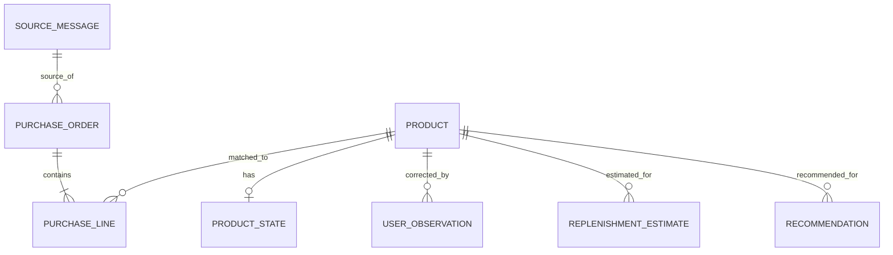

# Personal Commerce 基本設計

状態: Draft v0.1  
最終更新: 2026-10-05  
要件正本: `docs/personal-commerce/requirements.md`

## 1. 設計方針

MVPは「購買履歴を自動で蓄積し、購入周期を推定し、必要時に現在価格・代替商品をAIが調べて提案する」ことに集中する。

将来の自動購入を見越した過剰設計はしない。

設計原則:

- 既存Portal・Firebase資産を優先して活用する
- Firestoreをoperational dataの正本候補とする
- AIへDBの無制限な直接権限を与えない
- AIの書込みはApplication境界を経由する
- 事実、算出値、推定、推薦を分離する
- Gmailの注文メールを主要な購買データソースとする
- 厳密な在庫イベント管理はMVPで行わない
- BigQuery、MCP、Commerce protocolは必要性が出るまで導入しない
- 通常月額1,000円程度以内を目標とする

## 2. MVP論理アーキテクチャ

```text
Amazon / ヨドバシ
        │
        ▼
      Gmail
        │ 注文メール
        ▼
┌────────────────────┐
│ Application / API  │
│                    │
│ - Gmail取込        │
│ - AI構造化         │
│ - 重複・形式検証   │
│ - 購入履歴登録     │
│ - 購入周期計算     │
│ - 補充候補判定     │
│ - ユーザー補正     │
│ - Recommendation   │
└─────────┬──────────┘
          │ 許可された操作のみ
          ▼
     ┌───────────┐
     │ Firestore │
     └─────┬─────┘
           │
     ┌─────┴─────────────┐
     │                   │
     ▼                   ▼
AI会話 / Tool       週次判定
     │                   │
     │              AIで価格・代替調査
     │                   │
     └─────────┬─────────┘
               ▼
            Gmail
               │
               ▼
          ユーザーが購入
```

## 3. コンポーネント判断

| 要素 | MVP判断 | 理由 |
|---|---|---|
| Firebase Auth | 採用 | 既存Portalで利用済み。ユーザー識別に十分 |
| Firestore | 採用有力 | 個人規模のoperational dataに適する |
| GitHub Pages | 継続 | 既存Portalの公開方式を維持 |
| Cloud Run | 採用有力 | Gmail取込、AI処理、定期実行、DB書込境界をサーバー側に置く必要がある |
| Cloud Storage | 条件付き | PDF/CSV等のraw原本を保持する場合に利用。Gmailだけなら必須ではない |
| BigQuery | MVP不採用 | 購入周期計算は個人規模ではApplication処理で十分。DWH同期は過剰 |
| Money Forward | MVP外 | 補充判断の主目的には不要。支出分析時に再検討 |
| MCP | MVP不採用 | Tool境界は必要だがtransportをMCPに固定する要件がない |
| ADK等Agent framework | 未採用 | 単一AI + Toolで不足する場合に再検討 |
| UCP / ACP / A2A / AP2 | 将来 | 購入実行をMVPで行わないため不要 |

## 4. データモデル

### 4.1 最小エンティティ



### 4.2 PurchaseOrder

注文単位。

主な項目:

- id
- merchant
- ordered_at
- external_order_id
- source_message_id
- source_type
- created_at
- updated_at

### 4.3 PurchaseLine

注文明細単位。

主な項目:

- id
- purchase_order_id
- raw_product_name
- product_id
- quantity
- amount
- currency
- source_line_ref

数量・価格が取得できない場合はnullを許容する。

### 4.4 Product

MVPではProductVariantを分離しない。

主な項目:

- id
- canonical_name
- aliases
- category
- brand
- size_value
- size_unit
- package_type
- replenishment_status
- user_confirmed

容量や包装が異なる場合は原則別Productとして扱う。

### 4.5 ProductState

厳密な在庫数ではなく、現在状態の粗い表現。

例:

- unknown
- likely_available
- running_low
- spare_available
- out_of_stock

ユーザー明示情報をAI推定より優先する。

### 4.6 UserObservation / Correction

ユーザーによる補正・訂正。

主な項目:

- id
- product_id
- observation_type
- value
- note
- observed_at
- recorded_at
- source = user

### 4.7 ReplenishmentEstimate

購入周期から計算した推定。

主な項目:

- product_id
- average_interval_days
- median_interval_days
- observation_count
- estimated_next_purchase_at
- notify_from
- calculated_at
- confidence / note

`notify_from` は原則 `estimated_next_purchase_at - 7日`。

### 4.8 Recommendation

AIがその時点で生成した提案。

主な項目:

- product_id
- recommended_product
- current_price
- price_source
- alternatives
- rationale
- generated_at

価格は常時収集せず、必要時の観測値として扱う。

## 5. データ更新ルール

### 注文メール取込

1. Gmailから対象メールを取得
2. AIが注文番号、注文日、商品等を構造化
3. 必須項目・型を検証
4. `source_message_id`、注文番号等で重複確認
5. 原則自動確定してFirestoreへ保存
6. 商品名を既存Productへ照合
7. 誤りは後からCorrectionで修正可能にする

### 商品同一性

判定材料:

- brand
- 商品名
- category
- 容量
- package type
- 型番 / JAN等

AIによる誤統合をユーザーが訂正した場合、ユーザー判断を優先する。

### 現在使用中商品

優先順位:

1. ユーザー明示
2. 同カテゴリの直近購入
3. 同カテゴリ履歴から推定
4. unknown

## 6. 補充判定

1. 同一商品の購入履歴を取得
2. 連続購入日の差分を算出
3. 平均値・中央値を計算
4. 同一商品の履歴不足時は同カテゴリを補助利用
5. 次回購入時期を推定
6. 約7日前から補充候補化
7. 「まだある」「予備あり」等のUserObservationがあれば補正

高精度な需要予測は行わない。

## 7. AI / Tool境界

AIはFirestoreへ自由なクエリ・書込みを行わない。

初期Tool / Application operation候補:

- `get_purchase_history`
- `get_current_product`
- `get_replenishment_candidates`
- `record_user_observation`
- `correct_purchase_record`
- `get_product_context`
- `save_recommendation`（必要な場合）

商品価格・代替商品調査はAIの外部検索能力を利用し、結果のみApplication側へ必要に応じて渡す。

MCPはこの境界のtransport候補にすぎず、MVPでは実装しない。

## 8. 定期処理

週1回程度、以下を実行する。

```text
購入履歴更新
↓
購入周期再計算
↓
補充候補抽出
↓
候補がある場合のみ価格・代替商品をAI調査
↓
Gmailレポート生成・送信
```

候補がなければ原則メールを送らない。

## 9. セキュリティ

- Firebase uidを信頼境界のユーザー識別子とする
- サーバー処理ではuidを認証情報から確定する
- request bodyのuser_idを信用しない
- runtime Service Accountは最小権限とする
- 個人データを公開GitHubへ保存しない
- secretをGitHubへ直接保存しない
- AIへFirestore Admin相当の自由操作を与えない
- 入力元、更新元、更新時刻を追跡する

## 10. 可用性・復旧

- 高可用性構成は不要
- Gmailの元メールを再取込元として利用できる
- AI誤登録は元メールと更新履歴から訂正可能にする
- 本格的なイベントソーシングやマルチリージョンDRは行わない

## 11. 既存設計からの変更

### 維持

- Firebase Auth
- Firestoreをoperational正本とする考え方
- API / Application境界
- 冪等性
- 監査・訂正可能性
- 最小権限IAM
- Budget Alert
- payment credentialを保持しない方針

### 簡素化

- ProductVariantをMVPではProductへ統合
- InventoryEvent / unit / lot中心モデルを粗いProductState + UserObservationへ変更
- Money Forward financial transaction突合をMVP外へ移動
- BigQueryをMVP構成から外す
- Cloud Storageを必須から条件付きへ変更

### 将来へ移動

- purchase_intent
- purchase_authorization
- checkout handoff
- AgentRun / ToolCallの詳細な専用モデル
- MCP transport
- UCP / ACP / A2A / AP2
- 条件付き自動購入

## 12. 実装順序

1. FirestoreのMVPデータモデル確定
2. 最小Application / API境界とFirebase認証
3. Gmail注文メールの取得・AI構造化・重複防止
4. PurchaseOrder / PurchaseLine / Product登録
5. 購入周期・補充候補計算
6. AI会話用Tool境界
7. 現在価格・代替商品のAI調査
8. 週次Gmailレポート
9. 実運用で精度・入力負荷・コストを確認

## 13. 基本設計で残る確認事項

実装直前に以下を具体化する。

- Gmail APIの認証・取得クエリ
- Cloud Runの実行方式と週次スケジュール方式
- Firestoreのcollection / document詳細
- AI provider / model
- Gmail送信方式
- 監査ログの最小項目

これらは要件変更ではなく、基本設計・詳細設計上の決定事項とする。